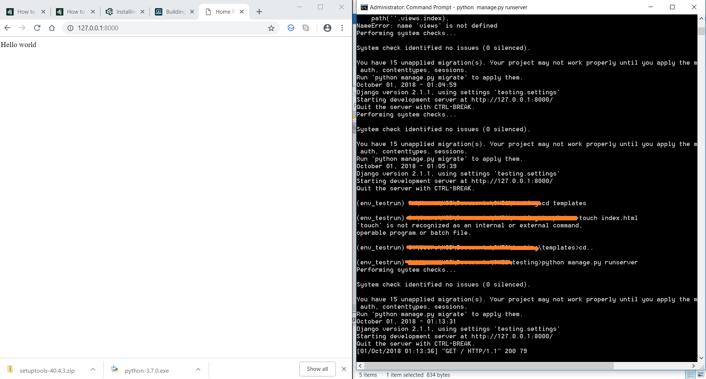
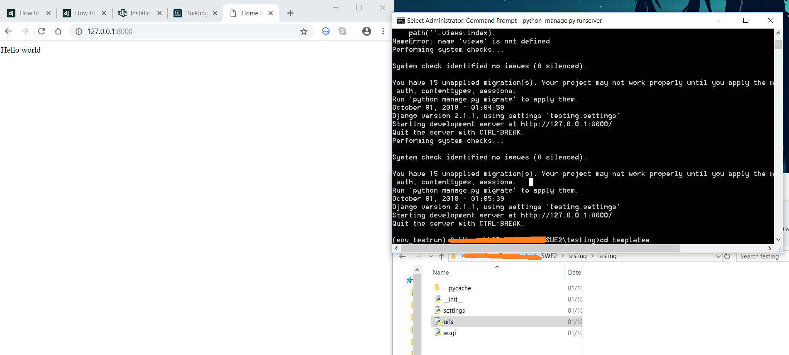
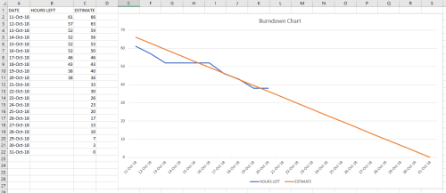
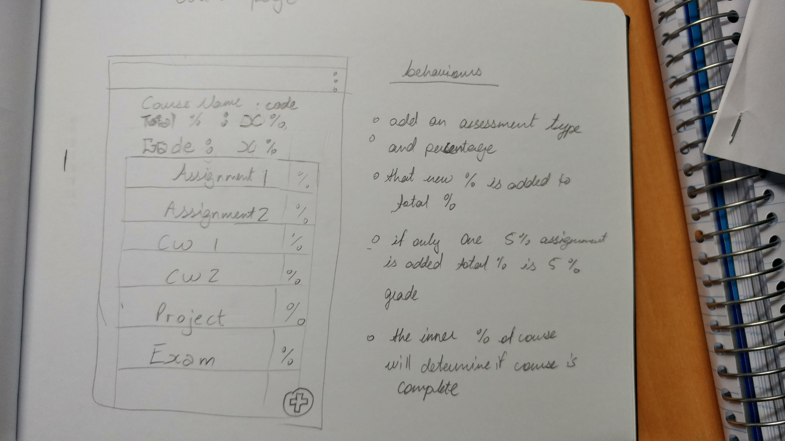
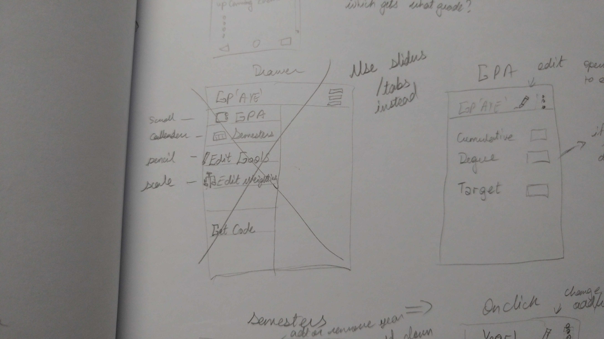
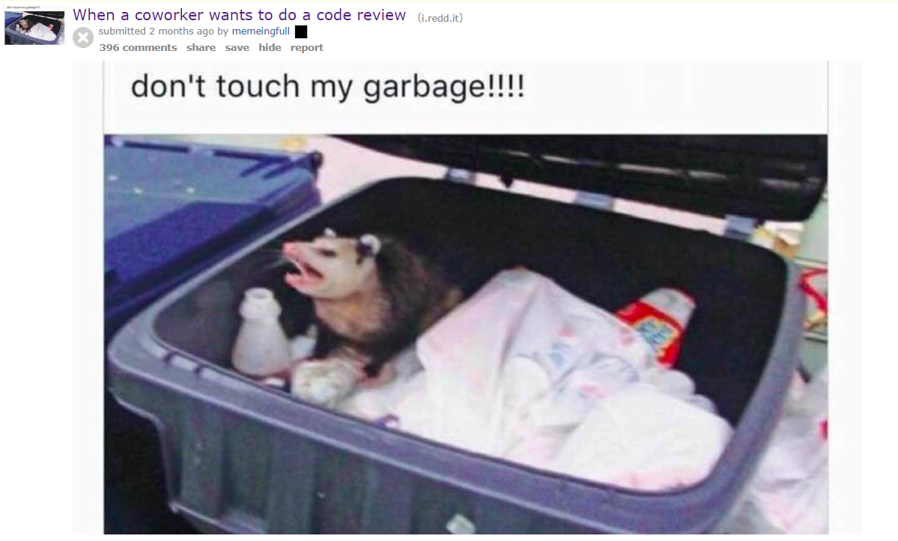
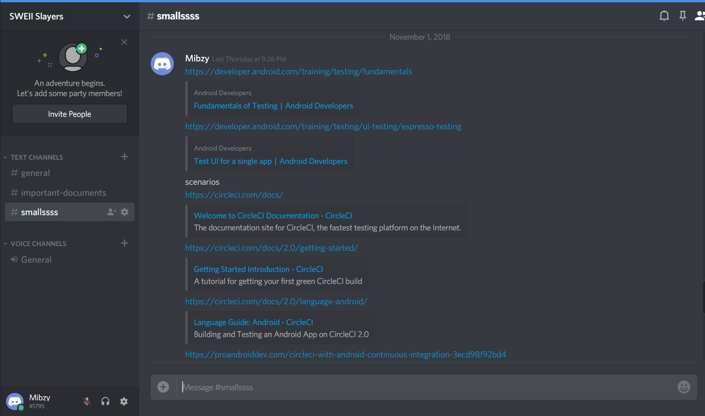
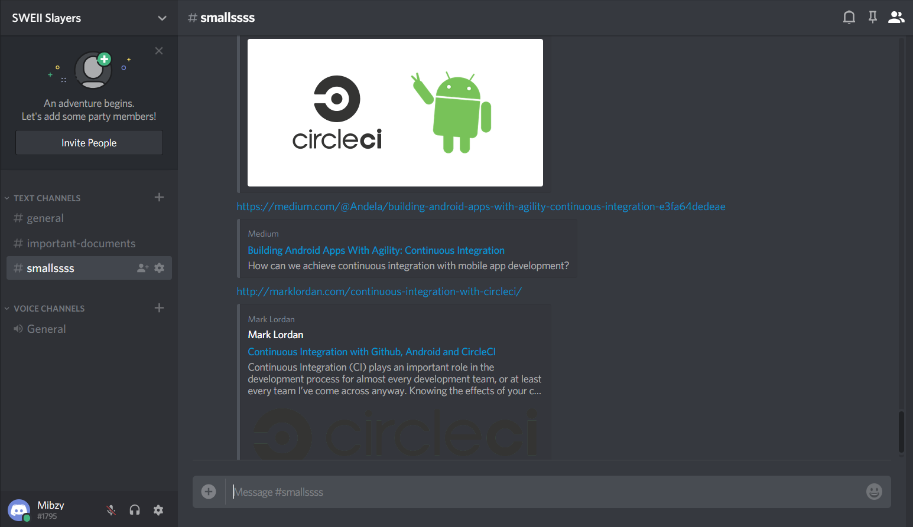
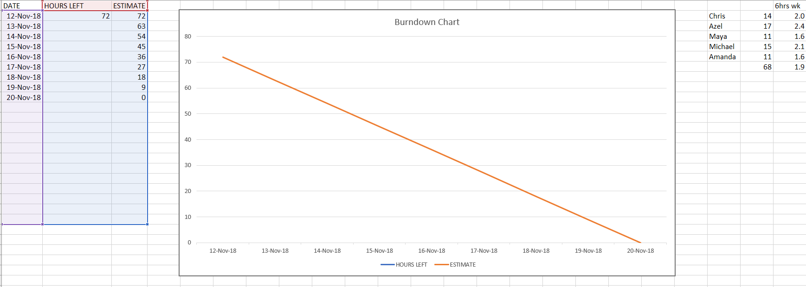
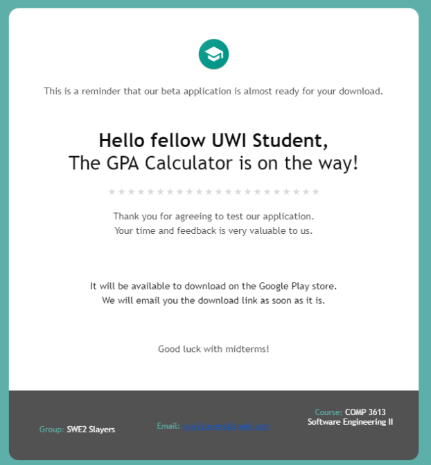

**Software Engineering II- Journal**

### 26th September 2018
**First group meeting**
* The team agreed on meeting time, decided who would be Scrum Master and Project owner and fleshed out ideas.
* Michael pitched the idea to one potential end user, and they gave feedback. Thus we decided to gain requirements through student questionnaires and interviews.
* Online meeting scheduled for tomorrow (Thursday) night, to discuss second milestone and further plans of action.

### 27th September 2018
**First online group meeting**
* The group started the questionnaire process; figuring out what questions to ask.
* Did research on already existing applications like ours.
* Questionnaire planning was given 2 days with the public release on Monday and data review Tuesday evening.
* Meeting on Saturday to discuss questionnaire questions.

### 29th September 2018
**Second online group meeting**
* Did not participate in group call due to weak connection, however stayed vigilant on links and partial conversations shared in chat
* The group created the questionnaire, everyone contributed to the questions and edits were made
* The questionnaire is on Google forms and the link will be shared in various UWI chat groups
* Questionnaire sent to Lecturer for advice/critique

### 30th September 2018  
**Research and Self-improvement**
				 
* Reading up on the platforms and technologies discussed by group. Currently have 0 knowledge in Django, plan to attempt small projects to familiarize self
* Break Down of weekday
	* Read up about Django, check documentation
	* Attempt a basic hello world, basic input, output and calculations
	* Try design and layout editing with Django (research if its even a thing)*
	* Talk to group about other features of app to add to practice
	* See how much I can do from ground zero in 4 hours
* Break Down of Weekend 
	* Refresh memory on Firebase
	* Attempt a basic connection to dummy application
	* Plan out potential database schema, and discuss with group

* EDIT: Nope, just a framework, can use templates or create own using HTML,CSS etc. So 'deign and Layout planning while implementation Django'.
				 
### 1st October 2018  
**Research and Self-improvement and other activities- Update 1**

* Read up Django documentation, updated python and pip. 
* Set up environment for windows. 
* Did a tutorial on how to set up and display hello world with django. 
* Had multiple errors and setbacks (folder mix up and wrong path or name given). 
* Kept getting weird syntax error, scrapped app and project, kept virtual environment and retried the steps. 
* Learned tutorial was catering for 1.x.x version and the 2.x.x changed formats (path vs url) found new [tutorial](https://www.codementor.io/kratos/building-an-hello-world-application-with-python-django-95sysyr6v)
* Merged new tutorials together.The [first tutorial](https://djangobook.com/installing-django/) explained why and*what to watch out for but ended up googling what they meant out of confusion in some parts.And second mentioned in point before, helped with the displaying "Hello,world". However need to review it to understand the process more. 
* Completed 1st task and 1/5 of second. 

### 2nd October 2018  
**Project Updates**
				 
* Time-line for questionnaire extended, still in planning phase. New expected time to be discussed in group. 
* Questionnaire reviewed and passed inspection with lecturer. Adding physical one-on-one interviews or group interviews with current and recently graduated students 
* I will be writing and conducting the one-on-one interviews(Will be added to feasibility study). The Interview format and questions were reviewed by team, input was given. The ideal sample size is 15, we will accept 13 as the minimum  
* [Questionnaire](https://docs.google.com/forms/d/1rln909jPsF6QTwPKlbZCV4Zkkb7f1zAIsKiwgj9H9M4/edit) was made public this evening 
* Group meeting scheduled for 9:30, to discuss second milestone and app specifications 

* Interview questions Format 
	1. Pre-Application explanation
	   * What is your student id and major? 
	   * Do you keep track of your GPA during the semester? 
	   * How do you calculate your GPA? 
	2. Post Application explanation
	   * Would you use this app? 
	   * if no, why? 
	3. Explain already planned features
	   * What are your feelings about the app now? 
	   * What features are your favourite? What should be changed? Do you have any other features in mind? 
	4. Post interview
           * Final overall opinion of app?  
	   * Any questions? 

**3rd Online Group Meeting**

* Broke down what we needed for second milestone 
* Discussed where to put processed data from survey and interview in project justification and feasibility study 
* Talked about potential application development platforms, Web app vs Android native app.  
* Michael made mention of using unity to create the app. Decision should be made by this week, so development can begin 
* New questionnaire and interview deadline is tomorrow  
* May have to scrap learning Django, will continue in case of changes. 
* I was a bit hesitant about using unity (A game engine, for a non-graphical app. Maybe it’s possible to remove unneeded libraries, packages and features?), but if majority ruled I will put in the hard work 
* Talked about using Xamarin...to be discussed further 

* Wrote 2nd milestone in shared [Google doc](https://docs.google.com/document/d/1NO_lZkdvrAYv8T7Ms1wrXnUNyy6FGIgxm57Ky47fQ7I/edit?usp=sharing)
* compromised on system requirements from currently available data from survey and interviews 
* Analyze requirements using App description as guideline(set a project project scope) 
* Paused group meeting to finish up another assignment 

### 4th October 2018  
**4th Online group meeting**

* Agreed to meet at Mondays at 6pm. Therefore, two definite meeting times Thursday 9pm and Monday 6pm 
* Technologies decided on: Android studio and Firebase 
* Discussed tasks in terms of SCRUM, and when would we know when sprints are needed. 
* Started planning backlog with SCRUM master(Christopher) and requirements were validated by product owner(Michael) 
* Started pulling out the main feature of the app, and what are secondary and other features 
* Tasks were still too bulky and were broken down more by SCRUM Master and team 
* Backlog discussion and breakdown took 2hrs, meeting was adjourned after agreement for a physical meeting tomorrow 2pm-3pm 

### 5th October 2018  
**Research, Self-Improvements and other activities- Update 2**

* Reviewed group sprint backlog and revised my own from the tasks they created [Sprint backlog](https://docs.google.com/document/d/1H7IePegMNoOtisnJLxQNtQF_TbOBIb-35PeHaqPONss/edit)
* Slightly concerned on how groups version is not done by modules(Performing tasks as small functioning products and slowly adding to it) but broken down into class implementing   
* Read up on SCRUM, may request to be 3rd SCRUM master 
* discussed with group sprint backlog I created. Hybrid was decided on tasks broken into similar categories focus still on class creations 

### 8th October 2018  
**5th Online group meeting**

* Discussed the assignment of tasks and final discussion of sprint log 
* Everyone chose the tasks they are confident with 
* Amanda introduced us to [Scrumy](https://scrumy.com/sweproject). We will use it to assign tasks and keep track of tasks 
* Some tasks were removed and will be reintroduced in second sprint (Firebase, Predictive calculations etc) 
* My tasks :  

	* [ ] Add functionality to course detail page 
	* [ ] Write to sqlite 
	* [ ] Access and pull from sqllite 
	* [ ] Update sql data and reflect in correct fields 

* Next meeting we will discuss architecture, group git practices and code structure and practices 	
 
### 11th October 2018  
**6th online group meeting**

* Discussed Milestone 3  
* Finalized project architecture. A mixture of layer and mvc 
* Made sure everyone had access to android studio files via git 
* Started working on tasks from sprint back log 
* My tasks :  
	* [ ] Add functionality to course detail page- Got assigned to Christopher 
	* [ ] Write to sqlite 
	* [ ] Access and pull from sqllite 
	* [ ] Update sql data and reflect in correct fields 

* I will start as soon as the classes are structured so I can know what variables to store etc. Created classes with explanation so group will know what the classes added are for 
           
### 17th October 2018  
**Day 6 of sprint**
				 
* I have not started the tasks related to the sqlite as yet. 
* My tasks :  
	* [ ] Add functionality to course detail page- Got assigned to Christopher 
	* [x] Create year detail page UI- (was assigned originally to Michael) 
	* [ ] Write to sqlite 
	* [ ] Access and pull from sqllite 
	* [ ] Update sql data and reflect in correct fields 
		
* Conflicts:  Team code being pushed to git has errors. 
* UI might need further discussion with group 
* Slight communication issues. Should be easy to resolve. Will speak to scrum master 
* Team members taking on other unassigned tasks before current task completion,causing blockade for others 
* Conflict resolution :  Start working on my assigned tasks and recreate or modify them when needed parts are completed to keep time frame  

**Research, Self-Improvements and other activities- Update 3**
				 
* small musings: It's kind of hard to put a honest time frame on hours worked, since I like to take small breaks in between steps  
* Future specialization/ career path: Front-end and UX 
* Sketched proposed to group October 8th 2018 
* Read up on ui practices, whats in style, trendy when done right and completely outdated 
* ui-sketch5 is most resent proposal to group after first mock up layouts were done.  

* Used tutorial for [SQLite DB](https://javatutorial.net/android-sqlite-database-example). May be made redundant when Firebase is implemented.  
* Will not push anything yet as I am learning and remodeling to fit needs, thus new methods and additional arguments, change in schema and how certain method behave.  

### 18th-19th (late night work) October 2018  
**7-8th Day of sprint** 
				 

* Due to the activities on campus today and an upcoming exam for multiple group members no meeting was held today. 
* Will ask for comments from team 
* I placed all coding on pause till tomorrow. Preferred planning out before integrating or creating anything. 
* Wrote down things I believed were needed for database by thinking data examples then branched out. Image below. 

* Planned out database: SQLite and Firebase. Placed in [GoogleDocs](https://docs.google.com/document/d/1ksK1Qfhbh1xTBcslMPMNRTmRkhU5SfPA6kae7zHxV9M/edit?usp=sharing)
* My tasks :
	* [ ] Add functionality to course detail page- Got assigned to Christopher 
	* [x] Create year detail page UI- (was assigned originally to Michael)  
	* [x] Design and set-up SQLite and create environment (was pulled from a task that was still to bulky.Updated Scrumy and notified Scrum Master) 
	* [ ] Write to sqlite- In progress(Paused) 
	* [ ] Access and pull from sqlite- In progress (Paused) 
	* [ ] Update sql data and reflect in correct fields 

	

### 20th October 2018  
**ToDo's**
				 
* Modify schema for SQLite include table for GPA that will hold CurrentGpa,CumulativeGPA and TargetGPA. Will not hold any foreign keys but will have relations to the Semester table 
* Will not link new GPA table to Years table as that can be calculated by application  _(YearGPA= SUM(select semester.CurrentGPa as results where ....)/count(results))_  something like that...  
* Decide whether to make a general adapter that handles all table creation,deletion and update with the same functions. or create separate functions for all 7 tables (... probably not the latter) 
* My tasks :
	* [ ] Add functionality to course detail page- Got assigned to Christopher 
	* [x] Create year detail page UI- (was assigned originally to Michael)  
	* [x] Design and set-up SQLite and create environment (was pulled from a task that was still to bulky.Updated Scrumy and notified Scrum Master) 
	* [ ] Write to sqlite- In progress(continued) 
	* [ ] Access and pull from sqlite- In progress (Paused) 
	* [ ] Update sql data and reflect in correct fields 

### 24th October 2018  
**Work Update**
				 
* Scrapped Planned sql schema... Reviewed and Reconstructed [New Schema's](https://docs.google.com/document/d/1037-ddsonv-Jqjo_1Z0Y59nhM1KTjyBACSI7nKGEpk4/edit?usp=sharing)  
* Spent 8 hours bringing the 2 functions GpaAdapter and SQLDataBaseHelper to par with previous content(capabilities). 
* Pushed current work to show work is/was being done to the scrum master 
* ~~Decide whether to make a general adapter that handles all table creation,deletion and update with the same functions. or create separate functions for all 7 tables (... probably not the latter)~~ Did create separate functions for all. Seemed the cleanest,safest and easiest to document route. 
* Learned a lot about the Cursor interface [Google Developers 1](https://developer.android.com/reference/android/database/Cursor#getColumnIndexOrThrow(java.lang.String)and [Google Developers 2](https://google-developer-training.gitbooks.io/android-developer-fundamentals-course-concepts/content/en/Unit%204/101_c_sqlite_database.html)

* My tasks : 
	* [ ] Add functionality to course detail page- Got assigned to Christopher 
	* [x] Create year detail page UI- (was assigned originally to Michael) 
	* [x] Design and set-up SQLite and create environment (was pulled from a task that was still to bulky.Updated Scrumy and notified Scrum Master)
	* [x] Write to sqlite- In progress
	* [ ] Access and pull from sqlite- In progress 
	* [ ] Update sql data and reflect in correct fields- Blocked 

### 25th October 2018  
**Scrum meeting and Reflections**

**SRCUM MEETING**	

* Amanda talked about the blocks she faced when trying to implement the calculations  
* Christopher kept meeting in check by breaking all straying topics (persons going to into detail about how much work they have done) 
* Discuss branching problems  

* Meeting after scrum due to how many missed meetings 
* Michael cleared up code done by Azel and him.(break down of what it does) 
* UI and HCI Designs have been scrapped. New designs were created by Azel and Michael. 

* My tasks :
	* [ ] Add functionality to course detail page- Got assigned to Christopher 
	* [x] Create year detail page UI- (was assigned originally to Michael)  
	* [x] Design and set-up SQLite and create environment (was pulled from a task that was still to bulky.Updated Scrumy and notified Scrum Master)  
	* [ ] Write to sqlite- In progress- Completed(Got scrapped) 
	* [ ] Access and pull from sqlite- In progress(Got scrapped) 
	* [ ] Update sql data and reflect in correct fields- Blocked(Got scrapped) 

### 26th October 2018  
**Work Update 2**

* Removed SQLite classes from project: [GpaAdapter](https://gist.github.com/MayaUWI/c880c4dd6d6a2313818e87cdb291c4f3) and [SQLDataBaseHelper](https://gist.github.com/MayaUWI/36f6ee98c9787a36f10dca766f1847d9) 
* Review existing code for firbase (trace through, check for bugs etc) 
* Todo: Google Auth sign out, and find out why it gets a null pointer when through out the class it can access the GoogleSignInClient fine 

* My tasks : 
	* [ ] Add functionality to course detail page- Got assigned to Christopher 
	* [x] Create year detail page UI- (was assigned originally to Michael)  
	* [x] Design and set-up SQLite and create environment (was pulled from a task that was still to bulky.Updated Scrumy and notified Scrum Master)- 
	* [ ] Write to sqlite- In progress- Completed(Got scrapped) 
	* [ ] Access and pull from sqlite- In progress(Got scrapped) 
	* [ ] Update sql data and reflect in correct fields- Blocked(Got scrapped) 
	* [x] Firebase Offline (set persistence to enabled)- 
	* [ ] Firebase Auth log out- Inprogress 
		
### 29th October 2018  
**Sprint close off and review**

* Scrum master closed off sprint as the last task on the scrumy board was moved to done 
* Everyone gave feedback: How they felt, issues they had, how they solved it, what they learned, what they expect from other members 
* Final testing is scheduled next, followed by User testing 
* Second sprint will be discussed after user testing  
	 
### 1st November 2018  
**Testing (unit,UI,etc and User)**

* Links to tutorials were shared in discord chat 
* Discussed on what next week task are (Testing) and what methods are we going to use (Firebase? Android robolectric? Junit? espresso? All of the above?) 
* Testing previously was hard as the group focused on developing incrementally on class relations than product blocks.  But joint group decision of next sprint being fully modular in terms of developing in mini deployable tasks  
* The users from the one-on-one and interviews will be used for User testing after Circle CI and Application test cases are implemented 
* Switching of roles Product-Owner and SCRUM Master will be decided in meeting before second sprint.

### 8th November 2018
**Before sprint meeting**
* Group agreed to 3rd meeting date: Saturday and 9pm.
* Azel will be the next Scrum master.
* Michael will remain as the product owner.
* Testing will be done saturday, user testing within the week (Tuesday hopefully)
* Team discussed [2nd backlog](https://docs.google.com/document/d/11622hB5bmtMfLWnfNbIh-5QDW3icIt4tWNJm4WFN3Fc/edit)
* New Scrum board on [Scrumy](https://scrumy.com/sweproject_sprint2) 

### 12th November 2018
**Sprint meeting**
* BurnDown chart created by new SCRUM master Azel 

* Sprints starts today.
* Progress maybe slow as we have upcoming courseworks and assignments.
* Azel is uploading the app to googleplay
* Michael is hesitant to do the user testing, he want to brainstorm how we release this to the users and how testing is done. I think the app should be released and see how it survies in the wild (since that will really tell us if the app is great or not). Amanda is worried about the time constraints... Christopher just wants to get it done... Azel is trying to be the peace keeper.
* I mentioned the ability to use Google user download count and anyother information Google provides. Users can also rate the app and give feedback in comments.Also, to release the app as a beta since we expext unexpected bugs/errors and the emails sent to users who agreed in the survey can hold a link to the Playstore.
* Michael is the Project Owner, incharge of interaction with the users. He proposes a Google Feedback form and gave examples of what the form could entail. 
* To end the debate, Christopher and Amanda offered to create the Google feed back form.

* My Tasks: 
	* Testing:
		* [ ] Creating User Class
		* [ ] Cumulative GPA Calculation
		* [ ] Edit Profile Data
		* [ ] Update Semester GPA Reflective of Course
		
Will start after Math CW and Assignments.
		
### 15th November 2018
**Meeting and Sprint**

**Meeting**
* Talked about Circle CI
* Azel invited us into his CI team
* Michael had problems with his Android studio. His run configurations were... non existent. I worked with him to add back the configurations and the problem was solved.

**Sprint**
* Everyone talked about what they did for the sprint so far.
* Amanda created a card that will be sent to our users. 

* I reported that I started my [scrumy](https://scrumy.com/sweproject_sprint2) board tasks. Also, I shared a few tutorials and cleared up any misconceptions (Test vs androidTest).

### 17 November 2018
**Sprint**
* Christopher reported that he began his tasks and it can be pulled. He also found a floating variable that should have been assigned while writing tests.
* Micheal is stil confused as to how testing works and after a breif explination and suggestion to watch everyones code, he seemed a little less hesitant.
* Azel stated that he fixed a few bugs he found upon user testing.
* Amanda, had issues with a few of the classes containing calcuations, but they were resolved after Azel repairs.
* I have not done anything other than the two taks on the scrumy board and will continue on Tuesday.

* We also shared things we learned. (pressing ctrl+shift+t, to creat a new test, other testing methods other than JUnit4, and understanding how Circle CI uses the tests we have writen).

* My Tasks: 
	* Testing:
		* [ ] Creating User Class- Haitus( used a tutorial )
		* [ ] Cumulative GPA Calculation- Inprogress
		* [ ] Edit Profile Data- Inprogress
		* [ ] Update Semester GPA Reflective of Course

### 19th November 2018
* should fix the overflow problem in the jounal side overview panel.
**Sprint Meeting**
* Meeting was rescheduled for 7pm.
* Amanda reported that she found n error in the date class and made the corrections.
* Circle ci have set up configuration problems so that needs to be fixed.
* Christopher said that he has not done anything since Saturday.
* Micheal said he completed a task and will continue to tackle the others.
* I have not done anything else task wise. Looking up the errors given by Circle CI and will share with Azel what I've found.

### 21st November 2018
**Sprint Day 6**

* What I did in this sprint so far:
	* Edit Circle CI confi files. Fix errors detected by Cirlce CI, status now from fail to Successful.
	* Continue writing testing for the task assigned to me.
	
* Tutorials used left me a bit confused. But I learned that the reason the cache could not be restored and saved,gradle and tests not found   is because we did not have our application file as the main files in our SWE repo. Thus, a "reroute" had to be done (told CI to look into a blank folder and feed the files needed into it). I am still a bit confused about CI, but willing to learn more about it.
* Amanda expressed worry about doing Junit testing with firebase. I found mockito framework, and decided to do some reseach on it to see if it solves our problems (Will also ask sir for recommendations in class tomorrow).

* My Tasks: 
	* Testing:
		* [x] Creating User Class
		* [ ] Cumulative GPA Calculation- Inprogress
		* [ ] Edit Profile Data- Inprogress
		* [ ] Update Semester GPA Reflective of Course- Inprogress

### 22nd November 2018	
**Srpint**
* Amanda explained conversation with lecturer about our Firebase issue
* Michael is having internet issues and will not be joining us
* Azel wished to extend sprint to Monday
* Waiting for User Feedback from Version 1.0(1.0 since 1st sprint on our error was multiple increments)
* Learning from our errors. next increment will be version 1.3( 1.3 because we first fixed errors and bugs in code(1.2), then added the predictive grade features (1.3))
* We will try to fix the firebase issue tonight.

### 23rd November 2018
**Sprint Updates**
* Managed to work around firebase. Shared with team and now waiting for feedback to see if it worked for them also.
* Recommended that we record our next meeting to include in our journals.
* My Tasks: 
	* Testing:
		* [x] Creating User Class
		* [ ] Cumulative GPA Calculation- Inprogress
		* [x] Edit Profile Data
		* [ ] Update Semester GPA Reflective of Course- Inprogress

**Worries**
* "Proper" Testing will not be possible due to how our code is structured. What could have been done was the functions that perform tasks can return hashmaps to a Firebase function related to that funtions task. Example in UserController, the method updateYearForUser();

~~~
    public static void updateYearForUser(final User user, Year year, final FirebaseDatabaseHelper.Closable closable){
        if(year != null) {
            DatabaseReference myRef = FirebaseDatabaseHelper.getFirebaseDatabaseInstance().getReference();

            HashMap<String, Object> updates = new HashMap<>();

            updates.put(year.getYearId(), year);

            myRef.child("years").updateChildren(updates).addOnCompleteListener(new OnCompleteListener<Void>() {
                @Override
                public void onComplete(@NonNull Task<Void> task) {
                    closable.close(user);
                }
            });
        }
    }
~~~

What could have been done instead :
1. updateYearForUser handles only getting the changed values from user
~~~
    public static HashMap updateYearForUser(final User user, Year year){
        if(year != null) {
            HashMap<String, Object> updates = new HashMap<>();

            updates.put(year.getYearId(), year);
            
        return  updates;
    }
~~~
2. UpdateYearFirebase uses the Hashmap from updateYearForUser();

~~~
/*
//In the class EditYear, in function save()
//HashMap k =  updateYearForUser(user,year);
//UpdateYearFirebase(k,this);
*/
public void UpdateYearFirebase(HashMap updates,final  final FirebaseDatabaseHelper.Closable closable){
	if(!updates.ismpty()){
		DatabaseReference myRef = FirebaseDatabaseHelper.getFirebaseDatabaseInstance().getReference();
		myRef.child("years").updateChildren(updates).addOnCompleteListener(new OnCompleteListener<Void>() {
                @Override
                public void onComplete(@NonNull Task<Void> task) {
                    closable.close(user);
                }
            });
	}
}
~~~
* I will see if its possible to fix all the classes with these problems... Time however is very limited.

* I Informed group that testing is a sign of a complete increment and that I could not find any reading that stated that testing was within sprint tasks. I did find that they are 'tasks' that should have been done throughout the sprint in parallel with development. Live and learn I guess. Testing for 2nd increment will be done in parallel (Hopefully).

